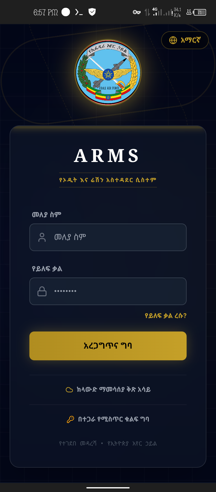
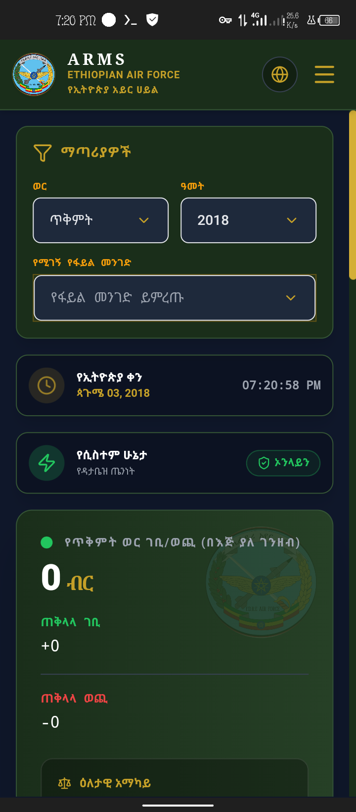
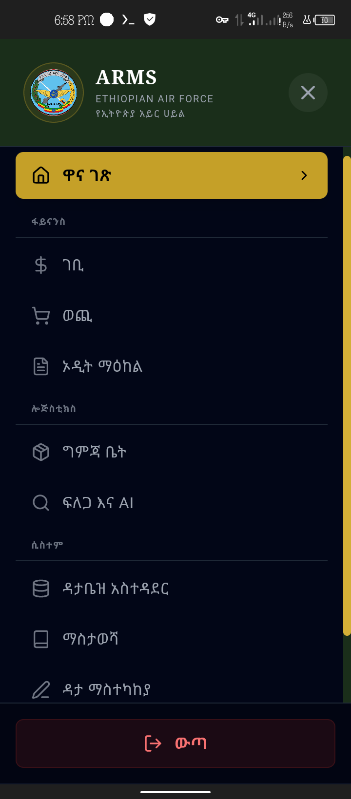
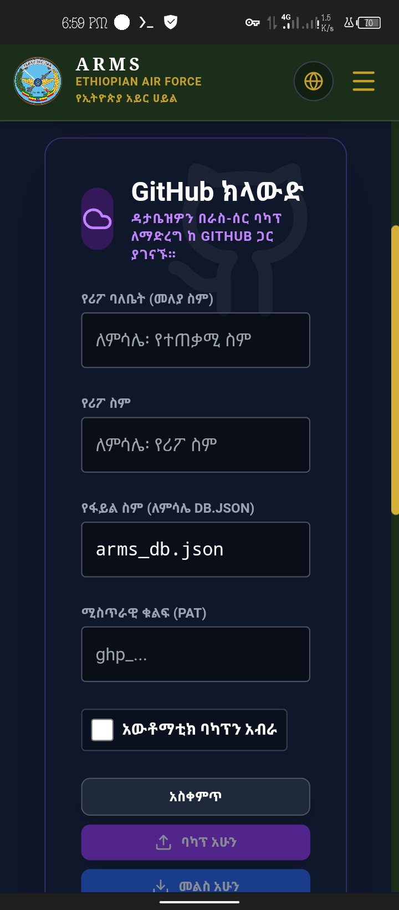

<div align="center">


# 🛡️ ARMS: Ethiopian Air Force Audit & Ration Management System
### 🇪🇹 የአዲት እና ሬሽን አስተዳደር ሲስተም

[](https://react.dev/)
[](https://www.typescriptlang.org/)
[](https://vitejs.dev/)
[](https://tailwindcss.com/)

</div>

---

## 📋 Overview
**ARMS (Auditing & Ration Management System)** is a modern, high-performance, and secure logistics, financial, and auditing platform developed for the **Ethiopian Air Force**. ARMS combines offline-first client architecture with decentralized cloud data synchronization and a serverless Google Gemini AI engine to deliver mission-ready operational efficiency.

> 📖 **Comprehensive Developer Documentation:** For in-depth architectural details, data flow diagrams, API schemas, and calendar mathematics, see [`docs/PROJECT_DOCUMENTATION.md`](docs/PROJECT_DOCUMENTATION.md).

---

## ✨ Key Features

### 💵 Financials & Auditing
* **Income & Expenditure Tracking:** Log financial transactions, sales of store items, subsidies, and personnel refunds.
* **Automated Audit Center:** Multi-ledger reconciliation, debit/credit balancing, and automated client-side PDF military audit generation via `html2pdf.js`.

### 📦 Logistics & Inventory
* **Store & Supply Management:** Track physical inventory with automated **Weighted Average Cost (WAC)** price recalculation upon receiving orders.
* **Daily Ration Deduction & Food Scheduling:** Computes ingredient requirements dynamically scaled to active manpower counts and daily recipes.
* **Astronomical Ethiopian Calendar Engine:** Native Julian Day Number (JDN) date calculations supporting 13 Ethiopian months, leap years, and Amharic pickers.

### ☁️ Decentralized Data Persistence (Git-as-a-Database)
* **Decentralized Storage:** Users sync their complete data state as structured JSON files directly to their own GitHub or Gitea repositories using Personal Access Tokens (PAT).
* **Automated Sequence & Month Folder Allocation:** Automatically organizes monthly backups into structured directory sequences (e.g. `november2018/arms001.json`).

### 🧠 Serverless Gemini AI Integration
* **AI Auditing & Logistics Forecasting:** Serverless Express proxy (`/api/gemini/*`) keeps API keys secure while powering natural language auditing, recipe optimization, and logistics chat assistants with multi-model fallback resiliency.

---

## ⚡ Quick Start: Instant Online Usage

You can use the fully functional system deployed live on Vercel right now:

> 🌐 **Live Web Application URL:** [https://arms-sandy.vercel.app/](https://arms-sandy.vercel.app/)

### How to use the live version:
1. Open the **Live Link** above.
2. Sign in using the default credentials:
   * **Username:** `admin` (or `etaf` for System Administrator)
   * **Password:** `admin` (or `etaf` for Admin)
3. Navigate to **Database Administration (ዳታቤዝ አስተዳደር)** from the menu sidebar.
4. Input your GitHub parameters (**Owner, Repo Name, and Personal Access Token**).
5. The application will bind to your repository, providing persistent decentralized cloud storage across sessions!

---

## 📸 Interface Preview

| 🔐 Secure Gateway | 📊 Command Dashboard |
|---|---|
|  |  |

| 🗂️ Navigation Engine | 🎛️ Cloud DB Management |
|---|---|
|  |  |

---

## 🚀 Getting Started (Run Locally)

### Prerequisites
* **Node.js** (v18.0.0 or higher; LTS v20/v22/v24 recommended)
* **npm** or **pnpm**
* **Git** (or Termux on Android)

### 🛠️ Execution Roadmap

#### 1. Setup & Installation
```bash
# Clone the repository
git clone https://github.com/ANK-369/ARMS.git
cd ARMS

# Install dependencies
npm install
```

#### 2. Configure Environment Variables
Create a `.env.local` or `.env` file in the project root to configure the Gemini AI key for server-side endpoints:

```ini
GEMINI_API_KEY=your_actual_gemini_api_key_here
```

*(Note: Users can also enter custom Gemini API keys at runtime via the Database Administration UI).*

#### 3. Launch Development Server
```bash
npm run dev
```
Open your browser at `http://localhost:3000`.

#### 4. Build for Production
```bash
npm run build
npm start
```

---

## 🔐 Credentials & Security Management

Authentication is managed via the **Web Crypto API (SHA-256 hashing)** with credentials stored locally and synced into the encrypted database state:

* **Standard User:** Default username `admin`, default password `admin`.
* **System Administrator:** Default username `etaf`, default password `etaf`.
* **Updating Credentials:** You do **not** need to modify source code. Log in as an administrator to change usernames and passwords directly via the **Admin Dashboard** or **System Access Settings**.
* **Password Recovery:** If credentials are lost, click **Forgot Password?** on the login terminal and provide the answer to your security challenge question (Default answer: `"air force"`).

---

## 🗄️ Cloud Synchronization (GitHub / Gitea)

To connect your operational data to your personal Git repository:
1. Navigate to **Database Administration (ዳታቤዝ አስተዳደር)**.
2. Enter your **GitHub Account Username** (e.g. `ANK-369`).
3. Enter your **Target Repository** (e.g. `ARMS`).
4. Enter your **Personal Access Token (PAT)** with repository read/write permissions.
5. Toggle **Enable GitHub Cloud Sync**. Every data modification will automatically persist and version-control to your repository.

---

## 📌 Project Status, Scope & Operational Disclaimer

> ⚠️ **Important Classification Note:** **ARMS** is an independent software initiative designed for the Ethiopian Air Force logistics workflows. It is currently utilized for localized daily operations and field auditing.

---

## 📚 Technical Documentation

For complete technical specifications, review [`docs/PROJECT_DOCUMENTATION.md`](docs/PROJECT_DOCUMENTATION.md) for details on:
* Complete file-by-file directory index
* Exact mathematical formulations for the Ethiopian Julian Day Number date converter
* Weighted Average Cost (WAC) formula and inventory replenishment flows
* Serverless Express architecture & Gemini multi-model fallback mechanics
* Data migration schemas and conflict resolution algorithms